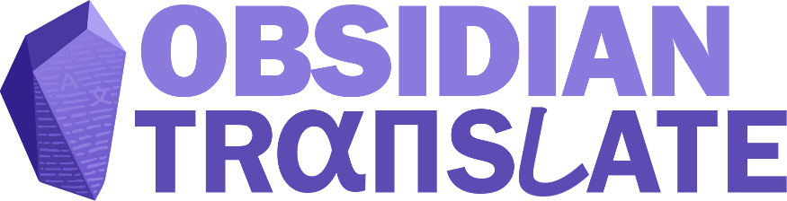
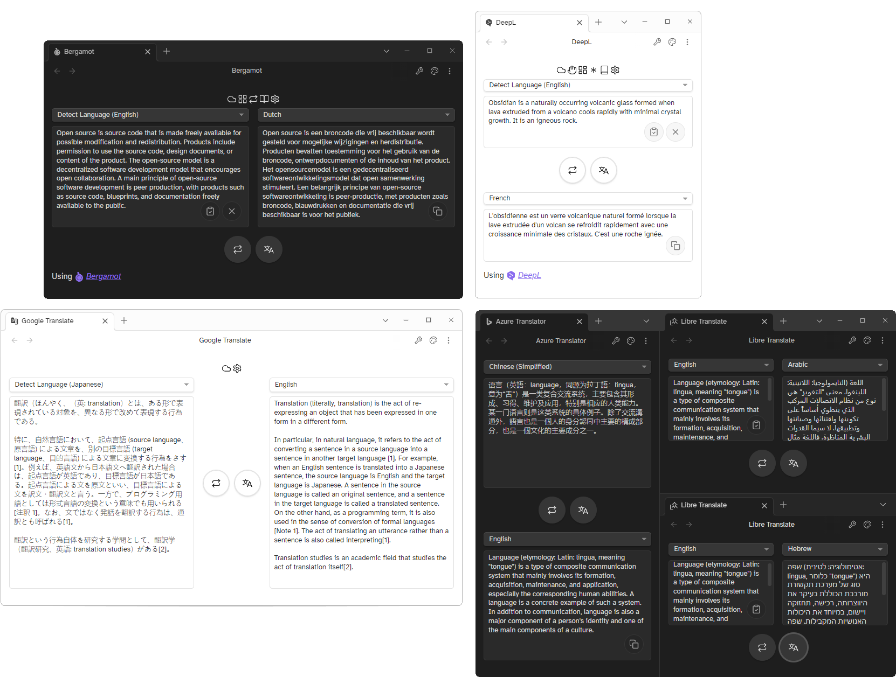

	

---

 

---

A plugin for [Obsidian](https://obsidian.md/) that adds several commands for translating text and files,
and also comes with an easy-to-use and extensively customizable translation interface that
integrates with ten different translation services. 

 

  

---

## Set-up

Enable the plugin by manually downloading one of the releases from GitHub, or by
using [BRAT](https://github.com/TfTHacker/obsidian42-brat).

To set up your translation service, open up the plugin's settings. In the `General` settings tab, opened by default,
select the translation service you want to use in the `Translation service` dropdown menu.

Next, head over to the settings tab of the service you've selected, and enter your API key (if necessary), and click the **validate**
button -- if the button turns green (indicating that you're properly connected to the service), you're good to go! 

Now, you can open the Translation View and start translating, or make a selection in your note and translate it
with the `Translate selection` command!

For most services, you _will_ have to sign-up for an account (with a credit card), check the 
[table below](https://github.com/fevol/obsidian-translate#services-overview) to see which services require sign-up.
***This plugin does not provide any API keys.*** 

### Free alternatives

If you wish to use a service that does not require any sign-up, there are three _free_ options available: 
- [Bergamot](https://browser.mt) (Using pre-trained language models, option to use [FastText](https://fasttext.cc/) for language detection,
  downloads provided within the plugin)
- [Libre Translate](https://libretranslate.com) (Using pre-trained language models, set up via Docker)
- [Lingva Translate](https://lingva.ml) (Google Translate web-scraper, 3rd party service)

Libre and Lingva Translate both offer a server that can handle translation requests, but every of the above mentioned options
can be entirely hosted on your own machine. Libre and Lingva translate can be hosted in a Docker container,
whereas Bergamot works directly from Obsidian.

---

## Translation Services
### Services overview

| Translation Service                                                                                 | Supported | Free                          | Offline | Mobile | Languages |
|-----------------------------------------------------------------------------------------------------|-----------|-------------------------------|---------|:-------|-----------|
|  Google Translate | ✅         | *(0.5M characters/month)* ¹ ² |         |        | 111       |
|  Deepl                       | ✅         | *(0.5M characters/month)* ¹   |         |        | 27        |
|  Yandex Translate | ❓         | ❌                             |         |        | 93        |
|  Libre Translate   | ✅         | ✅                             | ✅       |        | 30        |
|  Azure Translator | ✅         | *(2M characters/month)* ¹     |         |        | 111       |
|  Amazon Translate | ⭕         | *(2M characters/month)* ¹ ²   |         |        |           |
|  Bergamot                 | ✅         | ✅                             | ✅       | ❌      | 14        |
|  Fanyi QQ                 | ❓         |                               |         |        | 18        |
|  Fanyi Youdao         | ❓         |                               |         |        | 112       |
|  Fanyi Baidu           | ❓         |                               |         |        | 201       |
|  Lingva Translate | ✅         | ✅                             |         |        | 111       |

Icons displayed above are used in accordance with attribution requirements of each of the respective services.  
Listed services are in no way associated with this plugin.   

_¹ Requires a valid credit card to sign up for a free API key_ 
_² Your credit card will be charged if you exceed the free limit_ 

| Symbol | Description                         |
|--------|-------------------------------------|
| ✅      | Fully tested, **_should_** work     |
| ❌      | Fully tested, **does _not_** work   |
| ❓      | Implemented, **needs to be tested** |
| ⭕      | Plans to implement                  |

### Notes

- Most services require an _active_ internet connection to work. If you want to translate text offline, you can use
  [Bergamot](https://browser.mt) translation engine by installing the binary and its models, or host [Libre Translate](https://libretranslate.com) 
on your computer/network using any operating system with Docker or Flask (incl. [Android](https://gist.github.com/FreddieOliveira/efe850df7ff3951cb62d74bd770dce27)).
- Some services require a valid credit card to sign up for a free API key. Furthermore, the credit card will get charged if you go beyond the free character limit,
make sure to keep your eyes on it!
- Make sure that you _only_ enable automatic translation if you have a sufficiently high character cap on your API
  account, or the translation service is locally hosted (e.g. Bergamot or Libre Translate). This makes it easier
  to not blaze past your character limit.

---

## Features
For more information, head over to the [documentation](https://github.com/Fevol/obsidian-translate/blob/master/docs/TUTORIAL.md).

### Commands
- **Translate current file:** Translate _current_ file
- **Translate to new file:** Translate active document to new file, title of document also gets translated
- **Translate selection:** Translate current selection in the editor
- **Detect selection:** Detect language of current selection in the editor
- **Change provider:** Change the selected translation service provider
- **Open Translation View:** Open the custom translation view

### Context menus
In Editor:
- **Translate:** Translate current selection
- **Detect language:** Detect language of current selection

In Files: 
- **Translate:** Translate current file to a _new_ file

### Translation View
- Highly customisable
  - Change quick settings bar on top of the view
  - Change layout
  - Add quick actions
- Support for multiple views with different settings
- Automatic translation

---

## Future plans
### Features
- More auto-translate options
- Localization support
- Integration with Translation Memories
- Custom view for translation paragraph per paragraph
- Keep track of character limit

### Improvements
- Preservation of Markdown formatting
- Opening up integration with other plugins
- Reducing the amount of characters sent to the translation services
  - Caching translation results of sentence (continuous typing in translation view will not result in linear growth of amount of characters being sent over)
  - ...

Most up-to-date plans can be found [here](https://github.com/users/Fevol/projects/1)

---

## Disclaimers
### Legal
Obsidian Translate is not officially associated with any of the aforementioned translation services,
it only providers an user-facing UI to integrate with each of the services' APIs.

Asides from providing machine translation services between two languages, 
the respective services are not responsible for any modifications or alterations made to the source/translated text, 
unless explicitly stated in documentation or displayed in the UI.

### Privacy
The plugin will only make requests to translation services on specific user inputs, such as translating text or
downloading language models. The plugin will **not** send requests to any of the services on its own.

While the plugin does not collect any data, be aware that when translating, the text you wish to translate will be sent to
the your selected translation service. Refer to each of the translation services' privacy policies provided below to see how they process this data:
- [Google Translate](https://cloud.google.com/translate/data-usage)
- [DeepL](https://www.deepl.com/en/privacy.html)
- [Yandex Translate](https://yandex.com/legal/confidential/)
- [Microsoft Azure Translator](https://www.microsoft.com/en-us/translator/business/notrace/) ([general statement](https://azure.microsoft.com/en-us/support/legal/privacy-statement/))
- [Fanyi Baidu](https://fanyi-api.baidu.com/doc/5)
- [Fanyi QQ](https://www.qq.com/privacy.html)
- [Fanyi Youdao](https://cloud.tencent.com/document/product/551/34842)

As Bergamot and LibreTranslate are entirely self-hosted, their services do not have any privacy statements,
your data stays on your computer.

LingvaTranslate does not offer a privacy statement.

### Security
Please be aware that your API keys are stored in plain text by default,
and can be accessed by anyone with access to your vault. If you wish to keep your API keys private,
you can enable the option to encrypt them with a password under `General Settings`, or choose to only store them on the
device itself (without storing them in the plugin data). 

Note that the plugin cannot guarantee that your

---

## Discussion and Feedback
Any feedback would *very* much be appreciated. Please use the [GitHub issue tracker](https://github.com/Fevol/obsidian-translate/issues/new) to report bugs, request features,
or suggest improvements, or message me over on Discord (@Fevol#9470).

This plugin started off as a personal passion project. It ballooned into something much bigger than I had originally intended.
I hope that this plugin will be useful to you, and I hope to keep improving it in the future.

---

## Contributors
@kometenstaub - Helping me out many times throughout the development of this plugin and testing 
@sailkiteV - Teaching me in the arts of CSS wizardry and creating some of the animations 
@TfTHacker - Providing incredibly helpful feedback and testing 

---
## Support

I personally don't feel entirely comfortable receiving money for what I do, so before you consider donating to me,
consider some of these charities first:

- Local foodbanks and shelters
- [Doctors Without Borders/Médecins Sans Frontières](https://www.doctorswithoutborders.org/)
- FOSS projects you use and love 
  - (personal choice) [Mozilla](https://donate.mozilla.org/en-US/) (co-developed Bergamot)
  - [Wikimedia](https://donate.wikimedia.org/)
  
If you still feel like donating to me, you can do so here: 

<a href='https://ko-fi.com/fevol' target='_blank'>
